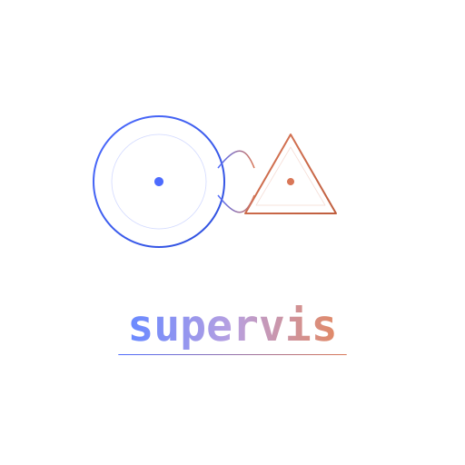

<p align="center">
  
</p>

<p align="center">
  <a href="https://pypi.org/project/supervis/"></a>
  <a href="https://pepy.tech/projects/supervis"></a>
  <a href="https://pypi.org/project/supervis/"></a>
  <a href="LICENSE"></a>
  <a href="https://deepwiki.com/arikusi/supervis"></a>
  <a href="https://github.com/arikusi/supervis"></a>
</p>

<h3 align="center">DeepSeek thinks, plans, and drives Claude Code through your project<br>so you don't babysit every prompt.</h3>

## What if you weren't the bottleneck?

Claude Code can read your codebase, write code, run builds, fix errors. It's remarkably capable. But here's the catch: **you** are still the one deciding what to do next. You break the task into steps, you prompt for each piece, you review and redirect. Even with plan mode and task lists, you're babysitting.

supervis puts [DeepSeek](https://platform.deepseek.com) between you and Claude Code as a technical lead. You describe what you want once. supervis handles the rest.

## Demo

One prompt. supervis took it from there: planned the approach, had Claude Code scaffold the project, build the UI, write the logic, run the build, and deploy to Cloudflare Pages. No human intervention between start and live URL.

<p align="center">
  
</p>

**Result:** [markdown-notes-31o.pages.dev](https://markdown-notes-31o.pages.dev/) · [source code](https://github.com/arikusi/markdown-notes) · *Full screenshots in [assets/](assets/) (demo_1 through demo_7)*

## How supervis works

DeepSeek tells Claude Code what to do. Claude Code explores the codebase, writes code, runs builds, and reports back. DeepSeek reviews the results and decides the next step. DeepSeek doesn't read your files directly. It directs and decides, Claude Code does the hands-on work. This keeps the supervisor's token usage low.

The loop keeps going until the **entire task** is done. You watch it work in real time, and step in only when you want to.

No more "can I edit this file?" prompts either. supervis runs Claude Code with `--permission-mode bypassPermissions`, so it reads, writes, builds, and tests without stopping to ask at every step. Under the hood, every task is a call to:

```
claude -p <prompt> --output-format stream-json --verbose --permission-mode bypassPermissions
```

You see everything Claude Code does: every file read, every edit, every shell command, live in the TUI. Full transparency, zero interruptions.

## Before supervis

Claude Code is great. You can give it plan mode, task lists, detailed prompts. But you're still the one leading the session. You check in after each step, redirect when something goes off track, decide what to tackle next, and prompt again when it stalls. That's fine for small tasks. For anything bigger, you're babysitting.

## With supervis

You describe the end goal once, and it drives Claude Code through the entire thing:

```
You: add JWT authentication with a login endpoint, protect all routes, make sure the build passes

DeepSeek: thinking...
┌─ Claude Code  Read project structure and check for existing auth...
│ Read: src/routes/index.ts
│ Read: package.json
│ No existing auth found.
└─ done (4 tool calls)
DeepSeek: No auth layer yet. Starting with JWT middleware, then login
          endpoint, then route protection.
┌─ Claude Code  Create JWT middleware and wire it up...
│ Write: src/auth/middleware.ts
│ Write: src/auth/login.ts
│ Edit: src/routes/index.ts
│ ↳ Bash: npm run build
│ Build passed.
└─ done (12 tool calls)
DeepSeek: Done. POST /auth/login returns a token, all routes
          verify it. Build is clean.
```

If the build had failed, supervis would have told Claude Code to fix the errors and try again, without you typing a single follow-up. It keeps going until the task is actually done.

Less technical knowledge? supervis handles the decisions you wouldn't know to make. More technical knowledge? You write better prompts and supervis becomes a serious force multiplier.

## Install

```bash
pipx install supervis
```

Or ask Claude Code: *"install supervis from github.com/arikusi/supervis"*

You need two things:
* [Claude Code](https://docs.anthropic.com/en/docs/claude-code) installed (subscription is enough, no Anthropic API key needed)
* A [DeepSeek API key](https://platform.deepseek.com/api-keys), or a key for any other OpenAI-compatible endpoint

supervis calls Claude Code as a local subprocess, not through the API. DeepSeek handles the planning via its own API, which is [remarkably cheap](https://api-docs.deepseek.com/quick_start/pricing) for what it delivers.

```bash
cd your-project
supervis
```

First run will ask for your DeepSeek API key and save it.

**Quick start:**
```bash
pipx install supervis && cd your-project && supervis
```

## Getting better results

supervis is only as good as the context it gets. A blank project works, but a project with a `.supervis/SUPERVIS.md` works significantly better:

```bash
mkdir .supervis
cat > .supervis/SUPERVIS.md << 'EOF'
Tech stack: Next.js 15, TypeScript, PostgreSQL, Tailwind CSS.
Follow the plan in PLAN.md.
Always run `npm run build` after making changes.
Use the existing auth patterns in src/lib/auth.
EOF
```

Think of it like onboarding a new developer. The more context you give (tech stack, conventions, existing patterns, a plan document), the fewer wrong turns supervis takes. Setting up relevant MCP servers and environment variables for your project also helps Claude Code do its job better.

**One important thing:** you're talking to a supervisor, not a code editor. supervis will delegate everything to Claude Code. Frame your prompts that way.

Example prompts:

```
Have Claude build me a personal portfolio site. I'm a frontend developer based
in Berlin, 3 years of experience, React and TypeScript. Include an about page,
project showcase, and contact form. Keep it clean and modern.
```

```
Have Claude set up a REST API for a todo app. Express, TypeScript. CRUD
endpoints, input validation, error handling. Have it write tests and run
them before finishing.
```

```
Have Claude read through this project, understand the architecture, then
add dark mode. Nothing should break. Run the build when done.
```

You tell supervis what you want. supervis tells Claude Code how to build it.

## Commands

| Command | What it does |
|---------|-------------|
| `/model` | Show the active tier and tiering state |
| `/model flash` \| `pro` | Pin a model (`flash-fast`/`pro-fast` skip thinking) |
| `/model auto` | Return to automatic tiering (flash, pro on escalation) |
| `/auto on` \| `off` | Toggle automatic escalation to pro |
| `/status` | Model tier, cost, uptime, message count |
| `/budget` | Cost vs. budget limit |
| `/export md` or `json` | Export conversation to file |
| `/undo` | Git stash or revert last changes |
| `/update` | Check for new supervis version |
| `/reasoning` | Toggle DeepSeek thinking/reasoning display |
| `/queue` | Show queued messages |
| `/cancel` | Cancel queued messages (`/cancel N` for specific) |
| `/reset` | Clear session and start fresh |

`Ctrl+Z` interrupts the running agent. `Ctrl+Q` quits. Up/down arrows cycle through input history.

From the shell: `supervis /path/to/project` works on a directory other than the current one, `--debug` mirrors the log to stderr, and `--version` / `--help` do what you would expect.

## Model tiering & self-correction

supervis runs on two DeepSeek V4 models and decides which one to use turn by turn, the way a lead splits work between routine calls and the hard ones.

Routine "drive Claude Code" steps run on **deepseek-v4-flash** — fast and cheap. supervis escalates to **deepseek-v4-pro** in two cases:

1. **It asks for help.** Facing a genuinely hard or architectural decision, supervis calls its `escalate` tool and the next step reasons on pro with full context.
2. **It gets stuck.** When Claude Code keeps failing the same way (errors, timeouts, or the same step repeating), supervis escalates on its own, drops a "stop, diagnose the root cause, re-plan" note into the conversation, and rethinks on pro instead of grinding the same broken approach. Once things recover, it falls back to flash to keep costs down.

The status bar shows the active tier, with `↑` when escalated. You stay in control: `/model pro` pins a model, `/model auto` hands tiering back to supervis, and `/auto off` disables automatic escalation entirely.

**It knows when to give up.** After five attempts that fail the same way, supervis stops instead of grinding, tells you it is stuck, and queues the next turn on pro — so whatever hint you come back with gets the stronger model. There is also a hard ceiling: `max_turns` (default 50) bounds how many tool-calling turns one message can trigger, so a model that keeps re-dispatching the same step can't run away with your budget. Set it to `0` if you want no cap.

## Configuration

TOML config, layered: built-in defaults → `~/.config/supervis/config.toml` → `.supervis/config.toml` → environment variables.

<details>
<summary>Example global config</summary>

```toml
api_key = "sk-..."
base_url = "https://api.deepseek.com"  # any OpenAI-compatible endpoint
model = "deepseek-v4-flash"   # base/driver tier
pro_model = "deepseek-v4-pro" # escalation tier
thinking = true
auto_escalate = true

[behavior]
max_cost = 1.00
max_turns = 50
shell_timeout = 15
claude_timeout = 1800
truncation_limit = 16000
```
</details>

<details>
<summary>Per-project override</summary>

```toml
model = "deepseek-v4-pro"   # run a tricky project on pro by default
auto_escalate = false       # ...and don't auto-tier

[behavior]
max_cost = 2.00
```
</details>

**Environment variables:** `SUPERVIS_API_KEY` (or `DEEPSEEK_API_KEY`), `SUPERVIS_BASE_URL`, `SUPERVIS_MODEL`, `SUPERVIS_PRO_MODEL`, `SUPERVIS_THINKING`, `SUPERVIS_AUTO_ESCALATE`

## Using a different provider

supervis talks to DeepSeek over the plain OpenAI chat-completions API, so any endpoint that speaks the same protocol works: OpenRouter, Moonshot, Zhipu, Together, a local vLLM or Ollama server. Point `base_url` at it and name the model.

```toml
base_url = "https://openrouter.ai/api/v1"
api_key = "sk-or-..."
model = "moonshotai/kimi-k2"

# supervis only ships DeepSeek's rate card, so tell it what yours costs.
# USD per 1M tokens. Omit `cached` if the provider has no prompt caching.
[pricing."moonshotai/kimi-k2"]
input = 0.60
cached = 0.15
output = 2.50
```

Three things change once you leave DeepSeek:

1. **Tiering collapses unless you set it up.** If you name a `model` and leave `pro_model` alone, supervis points both tiers at your model rather than escalating to a DeepSeek id your endpoint has never heard of. Set `pro_model` explicitly to get two tiers back.
2. **The thinking toggle goes quiet.** `thinking` is a DeepSeek API extension; sending it to another provider is a 400 waiting to happen, so supervis omits it. Use whatever reasoning control your provider offers, usually by picking a reasoning model.
3. **Costs are counted, not priced,** until you add a `[pricing]` block. The status bar shows tokens and says `cost unknown` rather than quoting DeepSeek's rates for somebody else's model.

`/model <id>` accepts any model id verbatim when you are off DeepSeek, so you can switch mid-session.

**`claude_timeout` is an idle timeout,** not a cap on total run time. A Claude Code task that keeps producing output runs as long as it needs; the clock only starts when it goes quiet. If it does stall, supervis kills the subprocess and hands back whatever output arrived before that.

The default is deliberately long (30 minutes). Claude Code emits a line per assistant turn and per tool result, so it stays silent for exactly as long as its current tool takes — a full test suite, a release build, or a container image is minutes of perfectly healthy silence. The timeout exists to catch a wedged process, not to bound your build. Lower it if you want faster detection and your tasks are short.

**Cost budget:** Set `max_cost` to cap spending. supervis warns at 80% and stops at 100%. There is no default limit; `max_turns` is the always-on runaway guard.

If a config file has a syntax error, supervis says so on startup instead of silently falling back to defaults.

> The legacy `deepseek-chat` / `deepseek-reasoner` ids were retired on 2026-07-24. If your config still names them, supervis transparently maps them to `deepseek-v4-flash` and prints a one-line notice.

## Cost

DeepSeek V4 pricing per 1M tokens — **flash:** $0.14 input · $0.0028 cached · $0.28 output; **pro:** $0.435 input · $0.003625 cached · $0.87 output. Because routine steps stay on flash and pro is reserved for the hard moments, most of a session is billed at flash rates. The status bar tracks cost in real time, priced per tier, so there are no surprises.

On another provider, supervis counts tokens but will not quote a dollar figure until you give it rates in a `[pricing]` block. A wrong number is worse than no number.

## What it doesn't do

* It's not magic. Vague prompts get vague results. Be specific about what you want.
* Claude Code runs with `bypassPermissions` (explained above). It edits files without asking. That's intentional, but be aware.
* Model tiering and thinking control are tuned for DeepSeek. Other providers work (see below), but you supervise the tiering yourself.
* No session persistence yet. Closing supervis loses the conversation.
* Large monorepos benefit from a focused `.supervis/SUPERVIS.md`. Without guidance, supervis may wander.

## Architecture

Event-driven, async. Business logic emits typed events through an EventBus. The Textual TUI subscribes and renders. Zero coupling between logic and UI.

<details>
<summary>Modules</summary>

```
supervisor/
  app.py           — Textual App, layout, key bindings, event bridge
  orchestrator.py  — async message loop, drives the agent
  deepseek.py      — DeepSeek API client, streaming, agent loop
  claude.py        — Claude Code subprocess, stream-json parsing
  session.py       — Session + CostTracker dataclasses
  events.py        — EventBus + typed event definitions
  commands.py      — slash command registry
  tools.py         — tool definitions for DeepSeek
  version_check.py — PyPI update checker
  config.py        — TOML config (global + per-project + env vars)
  memory.py        — conversation summarization
  prompts.py       — system prompt
  widgets/         — OutputLog, InputBar, StatusBar
```
</details>

## Contributing

Issues and PRs welcome at [github.com/arikusi/supervis](https://github.com/arikusi/supervis). Use [Discussions](https://github.com/arikusi/supervis/discussions) for questions and ideas.

## License

MIT — built by [arikusi](https://github.com/arikusi)
